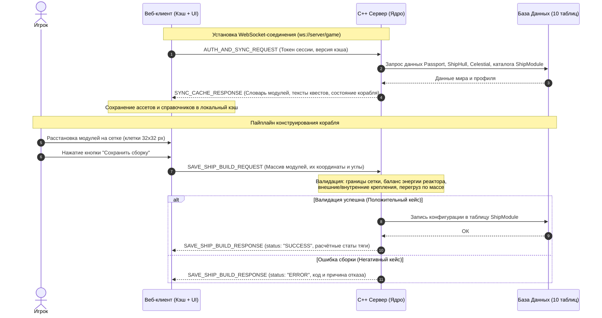

# 🔌 Спецификация контрактов (WebSockets API) — SpaceOdyssey

Документ описывает протокол информационного обмена между веб-клиентом (Frontend) и C++ ядром (Backend) поверх постоянного соединения **WebSockets**.

---

## 1. Архитектура взаимодействия и пайплайн (Sequence Diagram)

Для снижения сетевой нагрузки статические описания (каталог модулей, тексты квестов, пути к изображениям) кэшируются на клиенте при входе в игру, а сервер отвечает за БД, просчёт глобальной карты, валидацию сборок и хранение позиций игроков.



---

## 2. Базовый формат пакета (Envelope)

Все сообщения по WebSockets передаются в формате JSON и имеют единую обёртку:

```json
{
  "type": "НАЗВАНИЕ_СОБЫТИЯ",
  "request_id": "uuid-запроса-для-отслеживания",
  "timestamp": 1711800000,
  "payload": { }
}
```

---

## 3. Описание контрактов (Payloads)

### 3.1. Пайплайн сборки корабля (`SAVE_SHIP_BUILD`)
Используется, когда игрок завершает сборку корабля в ангаре и отправляет схему на сервер.

**Запрос от Клиента к Серверу (`SAVE_SHIP_BUILD_REQUEST`):**
```json
{
  "type": "SAVE_SHIP_BUILD_REQUEST",
  "request_id": "req-build-001",
  "payload": {
    "ship_hull_id": 42,
    "hull_class": "Фрегат",
    "modules": [
      {
        "module_template_id": 101,
        "module_category": "Реактор",
        "is_external": false,
        "size_w": 4,
        "size_h": 4,
        "grid_pos_x": 6,
        "grid_pos_y": 6,
        "mount_angle": 0.0
      },
      {
        "module_template_id": 205,
        "module_category": "Внешние орудия",
        "is_external": true,
        "size_w": 2,
        "size_h": 3,
        "grid_pos_x": 2,
        "grid_pos_y": 4,
        "mount_angle": 0.0
      },
      {
        "module_template_id": 310,
        "module_category": "Двигатель",
        "is_external": true,
        "size_w": 2,
        "size_h": 2,
        "grid_pos_x": 6,
        "grid_pos_y": 14,
        "mount_angle": 180.0
      }
    ]
  }
}
```

**Ответ Сервера — Успех (`SAVE_SHIP_BUILD_RESPONSE`):**
Сервер пересчитывает физику корабля (массу, энергобаланс, силу поворота в зависимости от радиуса до центра масс) и возвращает итоговые характеристики:
```json
{
  "type": "SAVE_SHIP_BUILD_RESPONSE",
  "request_id": "req-build-001",
  "payload": {
    "status": "SUCCESS",
    "computed_stats": {
      "total_mass": 1450.5,
      "energy_generation": 500,
      "energy_consumption": 120,
      "forward_thrust": 850.0,
      "strafe_thrust": 320.0,
      "torque_strength": 410.2
    }
  }
}
```

**Ответ Сервера — Ошибка валидации (Негативный кейс):**
```json
{
  "type": "SAVE_SHIP_BUILD_RESPONSE",
  "request_id": "req-build-001",
  "payload": {
    "status": "ERROR",
    "error_code": "INVALID_MODULE_PLACEMENT",
    "message": "Внешнее орудие (pos: 2, 4) установлено под углом 45°. Наружные модули неподвижны и должны быть направлены строго по курсу (0°)."
  }
}
```

---

### 3.2. Синхронизация клиентского кэша (`SYNC_CACHE_RESPONSE`)
Отправляется сервером при подключении клиента, чтобы закэшировать свойства частей корабля, описания квестов и ссылки на спрайты.

```json
{
  "type": "SYNC_CACHE_RESPONSE",
  "request_id": "req-sync-001",
  "payload": {
    "cache_version": "1.0.4",
    "module_catalog": [
      {
        "template_id": 205,
        "name": "Сдвоенный пулемёт",
        "module_category": "Орудия",
        "base_durability": 150,
        "energy_consumption": 0,
        "extra_resource_type": "projectile_762mm",
        "extra_resource_cost": 2,
        "reload_time_ms": 400,
        "efficiency": 256,
        "size_w": 2,
        "size_h": 3,
        "image_asset": "/assets/modules/machinegun_2x3.png"
      }
    ],
    "quest_descriptions": [
      {
        "quest_id": 12,
        "title": "Контрабанда на стыке границ",
        "quest_type": "доставка",
        "description": "Гос. чиновнику требуется без лишнего шума перевезти партию товара с чёрного рынка."
      }
    ]
  }
}
```

---

### 3.3. Обновление глобальной карты и орбит (`MAP_STATE_UPDATE`)
Сервер периодически рассылает координаты небесных тел (`framework/galactic/celestial.h`) и позиции игроков в зоне.

```json
{
  "type": "MAP_STATE_UPDATE",
  "timestamp": 1711800050,
  "payload": {
    "system_name": "Альфа Центавра",
    "controlling_state": "Федерация Ядра",
    "celestials": [
      {
        "id": 1,
        "name": "Гелиос",
        "body_type": "Star",
        "pos": { "x": 0.0, "y": 0.0 },
        "radius": 500.0,
        "gravity": 274.0
      },
      {
        "id": 2,
        "name": "Тортуга-4",
        "body_type": "Planet",
        "orbit_ellipse": { "semi_major": 2400.0, "semi_minor": 1800.0 },
        "pos": { "x": 1650.4, "y": -920.1 },
        "available_places": ["магазин", "база персонажа"]
      }
    ],
    "players_in_zone": [
      {
        "passport_id": 77,
        "full_name": "Капитан Скуф",
        "faction": "Нейтрал",
        "ship_hull_id": 42,
        "pos": { "x": 1600.0, "y": -900.0 },
        "rotation_angle": 45.0
      }
    ]
  }
}
```

---

### 3.4. Экран коммуникатора и событий (`COMMUNICATOR_SESSION`)
Передаёт данные для отрисовки интерфейса диалога с планетой или NPC (соответствует макету коммуникатора в Figma).

```json
{
  "type": "COMMUNICATOR_SESSION",
  "request_id": "req-comm-009",
  "payload": {
    "celestial_id": 2,
    "planet_header": "Планета Тортуга-4 на связи",
    "background_asset": "/assets/backgrounds/red_planet_simple.png",
    "interlocutor": {
      "passport_id": 904,
      "full_name": "Мистр хрен с горы",
      "species": "human",
      "avatar_url": "/assets/avatars/npc_suit.png",
      "attitude_status": "дружелюбное",
      "reputation_score": 65
    },
    "dialogue_text": "Че как бро, сегодня по пиву? Давай как обычно в 8",
    "related_event_type": "положительное"
  }
}
```
