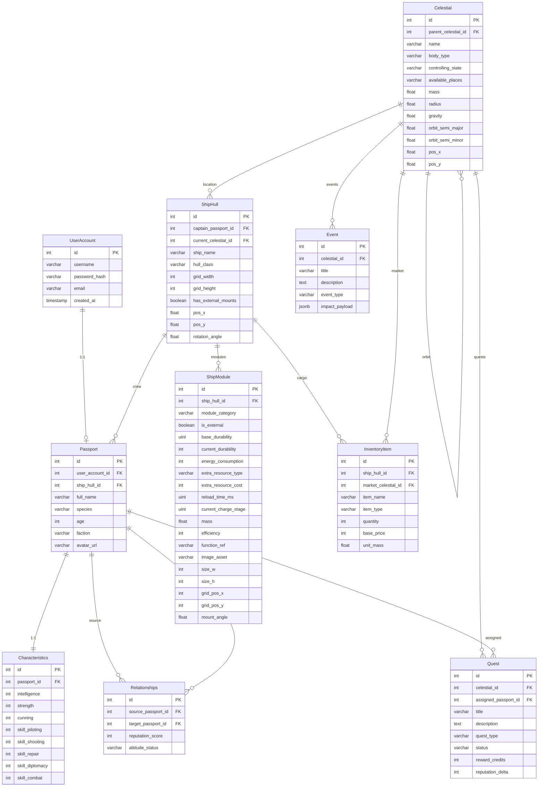

```mermaid
erDiagram
    UserAccount ||--o| Passport : "1:1"
    Passport ||--|| Characteristics : "1:1"
    Passport ||--o{ Relationships : "source"
    Passport ||--o{ Relationships : "target"
    
    ShipHull ||--o{ Passport : "crew"
    ShipHull ||--o{ ShipModule : "modules"
    ShipHull ||--o{ InventoryItem : "cargo"
    
    Celestial ||--o{ Celestial : "orbit"
    Celestial ||--o{ ShipHull : "location"
    Celestial ||--o{ Quest : "quests"
    Celestial ||--o{ Event : "events"
    Celestial ||--o{ InventoryItem : "market"
    
    Passport ||--o{ Quest : "assigned"

    UserAccount {
        int id PK
        varchar username
        varchar password_hash
        varchar email
        timestamp created_at
    }

    Passport {
        int id PK
        int user_account_id FK
        int ship_hull_id FK
        varchar full_name
        varchar species
        int age
        varchar faction
        varchar avatar_url
    }

    Characteristics {
        int id PK
        int passport_id FK
        int intelligence
        int strength
        int cunning
        int skill_piloting
        int skill_shooting
        int skill_repair
        int skill_diplomacy
        int skill_combat
    }

    Relationships {
        int id PK
        int source_passport_id FK
        int target_passport_id FK
        int reputation_score
        varchar attitude_status
    }

    Celestial {
        int id PK
        int parent_celestial_id FK
        varchar name
        varchar body_type
        varchar controlling_state
        varchar available_places
        float mass
        float radius
        float gravity
        float orbit_semi_major
        float orbit_semi_minor
        float pos_x
        float pos_y
    }

    ShipHull {
        int id PK
        int captain_passport_id FK
        int current_celestial_id FK
        varchar ship_name
        varchar hull_class
        int grid_width
        int grid_height
        boolean has_external_mounts
        float pos_x
        float pos_y
        float rotation_angle
    }

    ShipModule {
        int id PK
        int ship_hull_id FK
        varchar module_category
        boolean is_external
        uint base_durability
        int current_durability
        int energy_consumption
        varchar extra_resource_type
        int extra_resource_cost
        uint reload_time_ms
        uint current_charge_stage
        float mass
        int efficiency
        varchar function_ref
        varchar image_asset
        int size_w
        int size_h
        int grid_pos_x
        int grid_pos_y
        float mount_angle
    }

    Quest {
        int id PK
        int celestial_id FK
        int assigned_passport_id FK
        varchar title
        text description
        varchar quest_type
        varchar status
        int reward_credits
        int reputation_delta
    }

    Event {
        int id PK
        int celestial_id FK
        varchar title
        text description
        varchar event_type
        jsonb impact_payload
    }

    InventoryItem {
        int id PK
        int ship_hull_id FK
        int market_celestial_id FK
        varchar item_name
        varchar item_type
        int quantity
        int base_price
        float unit_mass
    }
```
