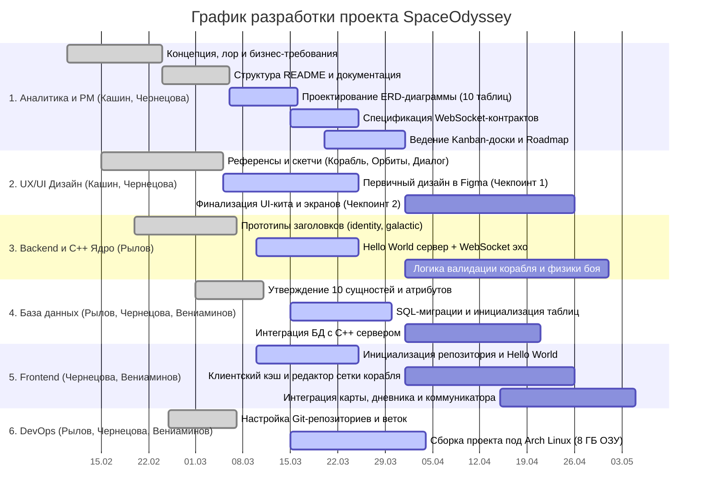

# 🗺 Дорожная карта (Roadmap) и График работ — SpaceOdyssey

Документ определяет этапы развития проекта **SpaceOdyssey**, распределение задач между участниками команды и контрольные точки (чекпоинты).

---

## 📅 Этапы развития проекта (Roadmap)

### Этап 1. Инициация и концептуальное проектирование (Лабораторная работа №1) — ✅ Завершено
* Формирование команды (4 человека) и распределение ролей с выделением ответственных.
* Разработка концепции, сеттинга и лора игры (противостояние государств, чёрный рынок, 30-летний главный герой в отставке).
* Определение ключевых игровых механик (глобальная карта, квесты, события, торговля, репутация, поклеточное конструирование корабля).
* Создание организации на GitHub (`SoftDevbyRVCHK`) и базовой структуры репозиториев.
* Первичные наброски архитектуры C++ ядра (`framework/identity`, `framework/galactic`) и референсы интерфейса в Figma.

### Этап 2. Архитектура, контракты и «Hello World» (Лабораторная работа №2 / Чекпоинт №1) — 🔄 В работе
* **Аналитика и документация:**
  * Завершение анализа бизнес-требований и согласование вариантов использования (Use Cases).
  * Проектирование принципиальной ERD-диаграммы базы данных (10 сущностей).
  * Определение контрактов взаимодействия Клиент $\leftrightarrow$ Сервер (WebSockets JSON API).
  * Формирование графика работ и настройка Kanban-доски в GitHub Projects.
* **Дизайн (UX/UI):**
  * Разработка первичного дизайна в Figma (макеты сетки конструирования корабля, экрана коммуникатора, визуализации эллиптических орбит).
* **Разработка (Backend / Frontend / DB / DevOps):**
  * Настройка git-репозиториев и структуры веток для клиентской и серверной частей.
  * Реализация «Hello World»-проектов: базовый запуск C++ сервера, инициализация веб-клиента и тестовое соединение по WebSockets.
  * Подготовка базовой конфигурации окружения (Docker / скрипты сборки).

### Этап 3. Реализация ядра и покрытие положительных кейсов (Лабораторная работа №3 / Чекпоинт №2) — ⏳ Планируется
*(Детальный пошаговый план этапа уточняется по итогам прохождения Чекпоинта №1)*
* **База данных и Backend (C++):**
  * Развёртывание реляционной БД по утверждённой ERD-схеме (10 таблиц).
  * Реализация математической модели космоса (`iVector2`, `iEllipse2`) и структур персонажей (`Passport`, `Characteristics`, `Relationships`).
  * Реализация серверной валидации сборки корабля, расчёта векторов тяги двигателей и механики пробития модулей.
* **Frontend (Веб-клиент):**
  * Реализация клиентского кэша (ассеты, свойства корабля, описания квестов, каталог модулей).
  * Интерактивный ангар (сетка `32x32` px) с возможностью расстановки модулей и отправки сборки на сервер.
  * Интерфейс глобальной карты, бортового дневника и окна коммуникатора.
* **Дизайн и Тестирование:**
  * Полное завершение дизайна всех игровых экранов в Figma.
  * Покрытие всех положительных пользовательских сценариев (Use Cases), подготовка к первому смотру приложения и ревью кодовой базы.

---

## 📊 Визуальный график работ (Диаграмма Ганта)

---

## 👥 Декомпозиция задач по участникам (к Чекпоинту №1 / Лаб. №2)

| Участник | Роли в проекте | Выполненные и текущие задачи (Лаб. 1–2) | Артефакт отчётности |
| :--- | :--- | :--- | :--- |
| **Кашин И.А.** | **PM**, **Системный аналитик**, **UX/UI Дизайнер** | Сборка проектной документации (`README.md`, `ERD.md`, `ROADMAP.md`), описание WebSocket-контрактов, настройка Kanban-доски, отрисовка макетов интерфейса (коммуникатор, сетка сборки) в Figma. | Репозиторий документации, проект в Figma, GitHub Projects |
| **Рылов А.С.** | **Тимлид**, **Backend**, **Database**, **DevOps** | Разработка архитектуры C++ ядра (`passport.h`, `characteristics.h`, `relationships.h`, `celestial.h`), проектирование структуры `ShipModule`, поднятие «Hello World» бэкенда, ревью веток. | Репозиторий Backend, коммиты с C++ структурой |
| **Чернецова Е.П.** | **Бизнес-аналитик**, **Frontend**, UX/UI, Database, DevOps | Формирование бизнес-требований, лора и списка из 12 механик, участие в проектировании 10 таблиц БД, базовая вёрстка клиентского «Hello World» приложения, макеты в Figma. | Репозиторий Frontend, репозиторий документации |
| **Вениаминов И.Д.** | Frontend, Database, DevOps | Инициализация окружения клиентской части, подготовка SQL-схемы таблиц БД, настройка конфигурации запуска и контейнеризации (DevOps). | Репозитории Frontend и Backend (конфиги БД и окружения) |
